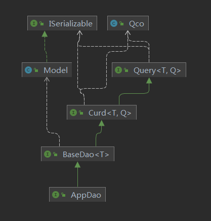

# 统一接口
框架顶层设计了 Query 、Curd 接口

将 Dao、Service、Controller、Api 等不同层的操作保持了一致；

采用了泛型的方式，使每一层面向的数据结构不同，但接口却又能保持一致，编写起来更友好简单；

[分层模型](layeredModel.md)

## 功能介绍
顶级Query  

顶级Curd  

Dao curd  
  
  

Service curd  
  

Controller curd  
  

## 例子
